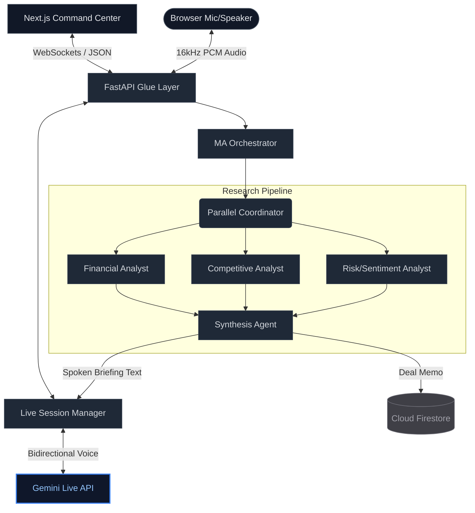

# CIMphony: M&A War Room

> Live M&A Due Diligence Platform. Columbia Business School × Google Hackathon 2026.

CIMphony is an autonomous, multi-agent command center designed to accelerate the M&A due diligence pipeline. It leverages the Gemini Live API and parallel LLM research agents to ingest real-time voice commands, analyze target companies systematically, and synthesize investment memorandums on demand.

---

## System Architecture

The project is structured around a real-time WebSocket connection unifying a React frontend with a heavy analytical Python backend.



---

## Technical Stack

- **Frontend**: Next.js 14, React, Tailwind CSS. Designed for static export and Firebase Hosting. Features raw Float32 to Int16 PCM AudioWorklets.
- **Backend**: FastAPI, Uvicorn, Python 3.12.
- **Agents**: Google Agent Development Kit (ADK), `gemini-2.0-flash`.
- **Voice**: Gemini Live API (`gemini-2.0-flash-live-001`), streaming 16kHz PCM audio.
- **Database**: Async Cloud Firestore.

---

## Project Structure

```text
├── backend/                  # Python backend & Agent Pipeline
│   ├── agents/               # ADK agent factories and Orchestrator
│   ├── prompts/              # Highly tuned instructions per agent persona
│   ├── services/             # Firestore CRUD and Audio Utilities
│   ├── live_session.py       # Gemini Live API WebSocket tunneling
│   ├── main.py               # FastAPI entrypoint (The Glue Layer)
│   └── requirements.txt      # Python dependencies
├── frontend/                 # Next.js Command Center UI
│   ├── app/                  # App router layout and pages
│   ├── components/           # UI pieces (BriefingFeed, DealMemo, RedFlagAlert)
│   ├── hooks/                # useWarRoom WebSocket state management
│   └── public/               # Static assets & worklets
└── tests/                    # Integration and unit test suite
```

---

## Local Development Workflow

Refer to `CLAUDE.md` and the `guidelines/` directory for strict contribution rules and the FAANG-aligned "vertical slice" integration methodology.

### Backend Setup
```bash
cd backend
python3 -m venv venv
source venv/bin/activate
pip install -r requirements.txt

# Start the WebSocket server
python main.py
```

### Frontend Setup
```bash
cd frontend
npm install
npm run dev
```

### Verification
Run tests ensuring minimum pipeline validation before any commits:
```bash
python -m pytest tests/ -v
```
